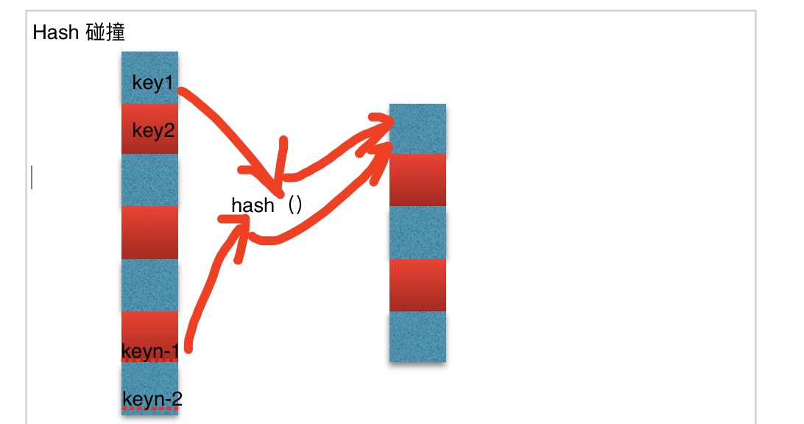
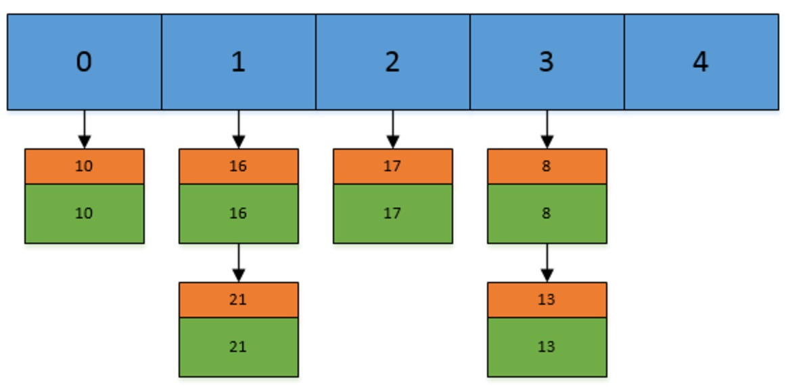
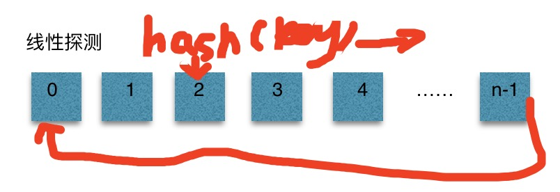

## 前言
又到了胡说八道时间，今天晚上接到携程电话面试（暑期实习面试），但是我正在填写银联数据的试卷（话说我面试已经过了，只要笔试过了就可以了，然而接了个电话，gg）。为什么写这个是因为今天面试问到我如何解决hash碰撞，学习知识才是王道。

## 哈希碰撞
哈希碰撞是不同的key通过哈希函数以后得到了相同的value值。原理图如下：

## 拉链法
Java标准库的HashMap和HashTable基本上就是用拉链法实现的。拉链法的实现比较简单，将链表和数组相结合。也就是说创建一个链表数组，数组中每一格就是一个链表。若遇到哈希冲突，则将冲突的值加到链表中即可。原理图如下：

步骤：
* 通过key算出hash值
* 通过hash值找到地址
* 如果地址为空，直接添加
* 如果地址不为空，插入表头

## 线性探测法
线性探索法是最简单的解决hash碰撞的方法。他把散列表当作一个循环数组看待。原理图如下：

步骤：
* 通过key算出hash值
* 通过hash值找到地址
* 如果地址为空，直接添加
* 如果地址不为空，地址++，回到上一步，循环的顺序是0-n-1-0

## 双重哈希法
hi=(h(key)+ih1(key))％m 0≤i≤m-1 //即di=i*h1(key) ，也就是使用两个哈希函数

## 再哈希法
简单的点说就是如果hash函数1发生冲突就换一个hash函数2

## 建立公共溢出区
这种方法的基本思想是：将哈希表分为基本表和溢出表两部分，凡是和基本表发生冲突的元素，一律填入溢出表

##参考链接
[blog1](http://threezj.com/2016/03/28/%E7%94%A8%E6%8B%89%E9%93%BE%E6%B3%95%E5%92%8C%E7%BA%BF%E6%80%A7%E6%8E%A2%E6%B5%8B%E6%B3%95%E8%A7%A3%E5%86%B3%E5%93%88%E5%B8%8C%E5%86%B2%E7%AA%81/)
[blog2](http://www.jianshu.com/p/eb335abc88dd)
