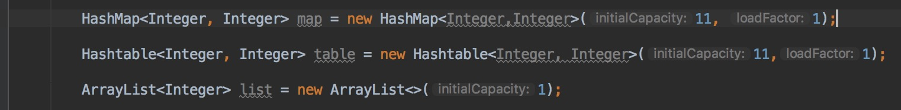

## 前言
我发现了，写博客什么的最有意思的时候还是写前言来的开心。反正就是瞎嗨为什么动笔。为什么写这个是因为今天面试的时候问当了下面这段代码中构造函数中的参数数是干嘛用的，问这个问题我当时很羞愧，其实有的时候自己也会去问为什么有这么多构造函数，具体应用场景是什么，然后就是没有刨根问底的精神。现在我就来刨根问底下也不晚吧，😂

## 所问代码
可以看到构造函数中都可以传入参数

* threshold：阈值，用于判断是否需要调整容量。threshold的值=”容量*加载因子”
* loadFactor：加载因子，通常设为0.75

## HashMap源代码为例子分析
Java.util.Hashtable类实现了JAVA中的哈希表，内部采用Node[]数组，每个Node均可作为链表的头，用来解决哈希碰撞。

## 特点
* 基于哈希表的 Map 接口的实现。
* 允许使用 null 值和 null 键。
* 此类不保证映射的顺序。

## Node类 源码
```
static class Node<K,V> implements Map.Entry<K,V> {
    final int hash;
    final K key;
    V value;
    Node<K,V> next;

    Node(int hash, K key, V value, Node<K,V> next) {
        this.hash = hash;
        this.key = key;
        this.value = value;
        this.next = next;
    }

    public final K getKey()        { return key; }
    public final V getValue()      { return value; }
    public final String toString() { return key + "=" + value; }

    public final int hashCode() {
        return Objects.hashCode(key) ^ Objects.hashCode(value);
    }

    public final V setValue(V newValue) {
        V oldValue = value;
        value = newValue;
        return oldValue;
    }

    public final boolean equals(Object o) {
        if (o == this)
            return true;
        if (o instanceof Map.Entry) {
            Map.Entry<?,?> e = (Map.Entry<?,?>)o;
            if (Objects.equals(key, e.getKey()) &&
                Objects.equals(value, e.getValue()))
                return true;
        }
        return false;
    }
}
```
<!--more-->

## 构造函数
```
 public HashMap(int initialCapacity) {
    this(initialCapacity, DEFAULT_LOAD_FACTOR);
}

/**
 * Constructs an empty <tt>HashMap</tt> with the default initial capacity
 * (16) and the default load factor (0.75).
 */
public HashMap() {
    this.loadFactor = DEFAULT_LOAD_FACTOR; // all other fields defaulted
}

/**
 * Constructs a new <tt>HashMap</tt> with the same mappings as the
 * specified <tt>Map</tt>.  The <tt>HashMap</tt> is created with
 * default load factor (0.75) and an initial capacity sufficient to
 * hold the mappings in the specified <tt>Map</tt>.
 *
 * @param   m the map whose mappings are to be placed in this map
 * @throws  NullPointerException if the specified map is null
 */
public HashMap(Map<? extends K, ? extends V> m) {
    this.loadFactor = DEFAULT_LOAD_FACTOR;
    putMapEntries(m, false);
}
```

## 扩容
通常，默认加载因子 (.75) 在时间和空间成本上寻求一种折衷。加载因子过高虽然减少了空间开销，但同时也增加了查询成本（在大多数 HashMap 类的操作中，包括 get 和 put 操作，都反映了这一点）。在设置初始容量时应该考虑到映射中所需的条目数及其加载因子，以便最大限度地减少 rehash 操作次数。如果初始容量大于最大条目数除以加载因子，则不会发生 rehash 操作。
```
final Node<K,V>[] resize() {
    Node<K,V>[] oldTab = table;
    int oldCap = (oldTab == null) ? 0 : oldTab.length;
    int oldThr = threshold;
    int newCap, newThr = 0;
    if (oldCap > 0) {
        if (oldCap >= MAXIMUM_CAPACITY) {
            threshold = Integer.MAX_VALUE;
            return oldTab;
        }
        else if ((newCap = oldCap << 1) < MAXIMUM_CAPACITY &&
                 oldCap >= DEFAULT_INITIAL_CAPACITY)
            newThr = oldThr << 1; // double threshold
    }
    else if (oldThr > 0) // initial capacity was placed in threshold
        newCap = oldThr;
    else {               // zero initial threshold signifies using defaults
        newCap = DEFAULT_INITIAL_CAPACITY;
        newThr = (int)(DEFAULT_LOAD_FACTOR * DEFAULT_INITIAL_CAPACITY);
    }
    if (newThr == 0) {
        float ft = (float)newCap * loadFactor;
        newThr = (newCap < MAXIMUM_CAPACITY && ft < (float)MAXIMUM_CAPACITY ?
                  (int)ft : Integer.MAX_VALUE);
    }
    threshold = newThr;
    @SuppressWarnings({"rawtypes","unchecked"})
        Node<K,V>[] newTab = (Node<K,V>[])new Node[newCap];
    table = newTab;
    if (oldTab != null) {
        for (int j = 0; j < oldCap; ++j) {
            Node<K,V> e;
            if ((e = oldTab[j]) != null) {
                oldTab[j] = null;
                if (e.next == null)
                    newTab[e.hash & (newCap - 1)] = e;
                else if (e instanceof TreeNode)
                    ((TreeNode<K,V>)e).split(this, newTab, j, oldCap);
                else { // preserve order
                    Node<K,V> loHead = null, loTail = null;
                    Node<K,V> hiHead = null, hiTail = null;
                    Node<K,V> next;
                    do {
                        next = e.next;
                        if ((e.hash & oldCap) == 0) {
                            if (loTail == null)
                                loHead = e;
                            else
                                loTail.next = e;
                            loTail = e;
                        }
                        else {
                            if (hiTail == null)
                                hiHead = e;
                            else
                                hiTail.next = e;
                            hiTail = e;
                        }
                    } while ((e = next) != null);
                    if (loTail != null) {
                        loTail.next = null;
                        newTab[j] = loHead;
                    }
                    if (hiTail != null) {
                        hiTail.next = null;
                        newTab[j + oldCap] = hiHead;
                    }
                }
            }
        }
    }
    return newTab;
}
```

## 参考资料
* jdk8api
* jdk源码