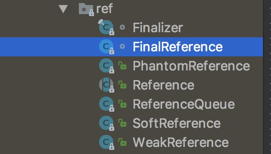

## 前言
紧张刺激的前言又来了，为什么会写这篇文档呢。因为我前两天阿里面试的时候问我了解引用吗，然后我说知道一点啊，回答的时候深拷贝和浅拷贝。但是呢具体的内层原理不知道，所以回答的时候呢就有点虚啊，为了以后理直气壮的回答面试问题，所以准备好好把这个问题弄清楚，问题总是会有的，慢慢解决就好了。

## 软件包 java.lang.ref
提供了引用对象类，支持在某种程度上与垃圾回收器之间的交互。程序可以使用一个引用对象来维持对另外某一对象的引用，所采用的方式是使后者仍然可以被回收器回收。程序还可以安排在回收器确定某一给定对象的可到达性已经更改之后的某个时间得到通知。我们都知道 JVM 中对象是被分配在堆（heap）上的，当程序行动中不再有引用指向这个对象时，这个对象就可以被垃圾回收器所回收。包结构如下图：


## 引用类型
引用类型（reference type）指向一个对象，不是原始值，指向对象的变量是引用变量。在java里面除去基本数据类型的其它类型都是引用数据类型，自己定义的class类都是引用类型。
```
引用对象的抽象基类。此类定义了常用于所有引用对象的操作。因为引用对象是通过与垃圾回收器的密切合作来实现的，所以不能直接为此类创建子类。
public abstract class Reference<T> {
    private T referent;         /* Treated specially by GC */
    ...
    public T get() {
        return this.referent;
    }
    public void clear() {
        this.referent = null;
    }
    ...
    Reference(T referent) {
        this(referent, null);
    }

    Reference(T referent, ReferenceQueue<? super T> queue) {
        this.referent = referent;
        this.queue = (queue == null) ? ReferenceQueue.NULL : queue;
    }

}

```

## StrongReference 强引用
* 强引用可以直接访问目标对象。
* 强引用所指向的对象在任何时候都不会被系统回收。
* 强引用可能导致内存泄漏(out of memory)。
实际上，FinalReference 代表的正是 Java 中的强引用，如这样的代码 :
```
Bean bean = new Bean();
```
在虚拟机的实现过程中，实际采用了 FinalReference 类对其进行引用。而 Finalizer，除了作为一个实现类外，更是在虚拟机中实现一个 FinalizerThread，以使虚拟机能够在所有的强引用被解除后实现内存清理。
整个FinalReference类的定义如下：
```
class FinalReference<T> extends Reference<T> {

    public FinalReference(T referent, ReferenceQueue<? super T> q) {
        super(referent, q);
    }
}
final class Finalizer extends FinalReference<Object> { 
	...
	private void runFinalizer(JavaLangAccess jla) {
        synchronized (this) {
            if (hasBeenFinalized()) return;
            remove();
        }
        try {
            Object finalizee = this.get();
            if (finalizee != null && !(finalizee instanceof java.lang.Enum)) {
                jla.invokeFinalize(finalizee);

                /* Clear stack slot containing this variable, to decrease
                   the chances of false retention with a conservative GC */
                finalizee = null;
            }
        } catch (Throwable x) { }
        super.clear();
    }
    ...
}
```

<!--more-->

## 软引用 SoftReference
* 在响应内存需要时，由垃圾回收器决定是否清除此对象。如果内存充足，则垃圾回收器不会回收该对象，如果内存不够了，就会回收这些对象的内存。
* 软引用对象最常用于实现内存敏感的缓存
* 软引用可以和一个引用队列（ReferenceQueue）联合使用，如果软引用所引用的对象被垃圾回收器回收，Java虚拟机就会把这个软引用加入到与之关联的引用队列中。
```
SoftReference类源代码
public class SoftReference<T> extends Reference<T> {
    static private long clock;
    private long timestamp;
    public SoftReference(T referent) {
        super(referent);
        this.timestamp = clock;
    }
    public SoftReference(T referent, ReferenceQueue<? super T> q) {
        super(referent, q);
        this.timestamp = clock;
    }
    public T get() {
        T o = super.get();
        if (o != null && this.timestamp != clock)
            this.timestamp = clock;
        return o;
    }

}
//SoftReference测试代码
public class Test {
    public static void main(String[] args) {
        SoftReference<Userx> bean = new SoftReference<Userx>(new Userx("name", 10));
        //返回此引用对象的指示对象。如果此引用对象已经由程序或垃圾回收器清除，则此方法将返回 null
        bean.get().say();
    }
}
//Userx类
public class Userx {
    private String name;
    private int age;
    public Userx(String name, int age) {
        this.name = name;
        this.age = age;
    }
    public void say() {
        System.out.println("my name is: " + name + ", age is: " + age);
    }
}
每一个对象通过软引用进行实例化，这个对象就以cache的形式保存起来，当再次调用这个对象时，那么直接通过软引用中的get（）方法，就可以得到对象中中的资源数据，这样就没必要再次进行读取了，直接从cache中就可以读取得到，当内存将要发生OOM的时候，GC会迅速把所有的软引用清除，防止oom发生。
```
## 弱引用 WeakRefrence
* 用来描述非必须的对象，但是它的强度比软引用更弱一些
* 被弱引用关联的对象只能生存到下一次垃圾收集发送之前
* 当垃圾收集器工作时，无论当前内存是否足够，都会回收掉只被弱引用关联的对象
* 一旦一个弱引用对象被垃圾回收器回收，便会加入到一个注册引用队列中
```
WeakRefrence源代码，只是继承了抽象类
public class WeakReference<T> extends Reference<T> {
    //创建引用给定对象的新的弱引用。新的引用没有向任何队列注册。
    public WeakReference(T referent) {
        super(referent);
    }
    //创建引用给定对象的新的弱引用，并向给定队列注册该引用。
    public WeakReference(T referent, ReferenceQueue<? super T> q) {
        super(referent, q);
    }

}
```
## 虚引用PhantomReference
* 一个持有虚引用的对象，和没有引用几乎是一样的，随时都有可能被垃圾回收器回收
* 虚引用的最大作用在于跟踪对象回收，清理被销毁对象的相关资源。
* 随时都有可能被垃圾回收器回收
```
PhantomReference源代码，可以看到它的get方法返回的是null
public class PhantomReference<T> extends Reference<T> {
    public T get() {
        return null;
    }
    public PhantomReference(T referent, ReferenceQueue<? super T> q) {
        super(referent, q);
    }

}
```
## 自动清除引用
在将软引用和弱引用添加到向其注册的队列（如果有）之前，回收器将自动清除这些引用。所以，软引用和弱引用不需要向队列注册即可使用，而虚引用则需要这样做。通过虚引用可到达的对象将仍然保持原状，直到清除所有这类引用或者它们本身变得不可到达。
<iframe frameborder="no" border="0" marginwidth="0" marginheight="0" width=330 height=86 src="//music.163.com/outchain/player?type=2&id=26936094&auto=1&height=66"></iframe>

## 参考链接
[blog](http://wuhuachuan.com/visitor/article/bfb643d5-4317-4b95-ab55-d0e1392e6c1d)
[深入探讨 java.lang.ref 包](https://www.ibm.com/developerworks/cn/java/j-lo-langref/)
[java引用类型](http://www.importnew.com/20468.html)