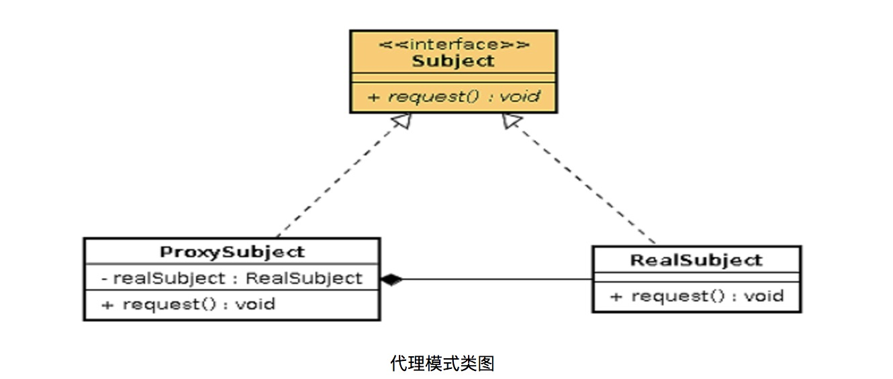

## 前言
又到了紧张刺激的前言了，前一段时间整理了hashmap以及解决hash碰撞的方法，然后今天在阿里第一次面试的时候就问到了。虽然这个回答的还可以，但是我对自己还是失望的，面试问我spring和主要概念aop我知不知道。讲真的，我老早就说准备看看，而且我还看过一遍，但是就只是那么匆匆一看，没有怎么在意。果然就像考试，只有仔细认真的人才会一直取得高分。所以我今天一天都在研究spring aop。


## 使用场景
面向切面区别于面向对象，由于琐碎的逻辑需要嵌入整体的项目框架。如果是面向对象需要在相应的对象中修改代码，这样显然很麻烦，而且琐碎的逻辑耦合在了项目中。如果使用面向切面，就可以减少耦合。通过面向切面可以不用修改原有项目代码，而是在外部找到添加代码，找到需要嵌入逻辑的地方标记好，那么运行的时候就会插入相应的代码。比如我们常用的如事务管理、安全检查、缓存、对象池管理。AOP 实现的关键就在于 AOP 框架自动创建的 AOP 代理.

## 实践出真知
启用 Spring 对 @AspectJ 方面配置的支持
```
在config类中添加@EnableAspectJAutoProxy注解
当启动了 @AspectJ 支持后，只要我们在 Spring 容器中配置一个带 @Aspect 注释的 Bean，Spring 将会自动识别该 Bean，并将该 Bean 作为切面 Bean 处理。
```

定义切面
```
@Aspect
public class TestAspect {
    @Before("execution(* com.example.web.LoginControlller.well(..))")
    public void logBefore(JoinPoint joinPoint) {

        System.out.println("logBefore() is running!");
        System.out.println("hijacked : " + joinPoint.getSignature().getName());
        System.out.println("******");
    }

    @After("execution(* com.example.web.LoginControlller.well(..))")
    public void logAfter(JoinPoint joinPoint) {

        System.out.println("logAfter() is running!");
        System.out.println("hijacked : " + joinPoint.getSignature().getName());
        System.out.println("******");

    }

    @AfterReturning(
            pointcut = "execution(* com.example.web.LoginControlller.well(..)))",
            returning= "result")
    public void logAfterReturning(JoinPoint joinPoint, Object result) {

        System.out.println("logAfterReturning() is running!");
        System.out.println("hijacked : " + joinPoint.getSignature().getName());
        System.out.println("Method returned value is : " + result);
        System.out.println("******");

    }
}
```
<!--more-->


定义控制器
```
@RestController
public class LoginControlller {
    @RequestMapping(value = "/login", method = RequestMethod.POST)
    public String login (@PathVariable String post) {
        System.out.println("login() is running ");
        return "hah";
    }
```
输出
```
logBefore() is running!
hijacked : well
******
get() is running 
logAfter() is running!
hijacked : well
******
logAfterReturning() is running!
hijacked : well
Method returned value is : well
******
```
## spring aop 的代理模式
```
Spring AOP defaults to using standard JDK dynamic proxies for AOP proxies. This enables any interface (or set of interfaces) to be proxied.

Spring AOP can also use CGLIB proxies. This is necessary to proxy classes rather than interfaces. CGLIB is used by default if a business object does not implement an interface. As it is good practice to program to interfaces rather than classes; business classes normally will implement one or more business interfaces. It is possible to force the use of CGLIB, in those (hopefully rare) cases where you need to advise a method that is not declared on an interface, or where you need to pass a proxied object to a method as a concrete type.

It is important to grasp the fact that Spring AOP is proxy-based. See Section 11.6.1, “Understanding AOP proxies” for a thorough examination of exactly what this implementation detail actually means.
```
这是官网对于spring aop代理的描述，这里可以看到
* 静态代理：使用 AOP 框架提供的命令进行编译，从而在编译阶段就可生成 AOP 代理类，因此也称为编译时增强；静态代理以 AspectJ 为代表。
* 动态代理：在运行时借助于 JDK 动态代理、CGLIB 等在内存中“临时”生成 AOP 动态代理类，因此也被称为运行时增强。Spring AOP 用的就是 动态代理

动态代理
* 如果目标对象实现了接口，默认会采用JDK的动态代理机制实现AOP 
* 如果目标对象实现了接口，可以强制使用CGLIB实现AOP 
* 如果目标对象没有实现接口，必须使用CGLIB生成代理，spring会自动在CGLIB和JDK动态代理之间切换 
* JDK代理只能对实现了接口的类生成代理，而不能针对类 
* CGLIB是针对类实现代理的，主要对指定的类生成一个子类，并覆盖其中的方法

## 原理解析
AOP 代理其实是由 AOP 框架动态生成的一个对象，该对象可作为目标对象使用。AOP 代理包含了目标对象的全部方法，但 AOP 代理中的方法与目标对象的方法存在差异：AOP 方法在特定切入点添加了增强处理，并回调了目标对象的方法。
代理类图：


### JDK动态代理
sping aop的jdk动态代理主要基于JdkDynamicAopProxy实现源代码如下：
```
final class JdkDynamicAopProxy implements AopProxy, InvocationHandler, Serializable {
	...
	//创建一个代理对象
	@Override
	public Object getProxy(ClassLoader classLoader) {
		if (logger.isDebugEnabled()) {
			logger.debug("Creating JDK dynamic proxy: target source is " + this.advised.getTargetSource());
		}
		Class<?>[] proxiedInterfaces = AopProxyUtils.completeProxiedInterfaces(this.advised, true);
		findDefinedEqualsAndHashCodeMethods(proxiedInterfaces);
		return Proxy.newProxyInstance(classLoader, proxiedInterfaces, this);
	}
	...
}
```
从源代码中我们可以看出这个类实现了AopProxy和InvoctionHandler接口。
```
而这个AopProxy中只定义了两个方法。这个接口是在spring中定义的。
public interface AopProxy {
	Object getProxy();
	Object getProxy(ClassLoader classLoader);

}
这个InvocationHandler接口是在jdk中定义的，其中只有一个方法invoke。
* InvocationHandler 是代理实例的调用处理程序 实现的接口
* 包名可以看出使用到了反射
* 每个代理实例都具有一个关联的调用处理程序。对代理实例调用方法时，将对方法调用进行编码并将其指派到它的调用处理程序的 invoke 方法。
package java.lang.reflect;
public interface InvocationHandler {
    //在代理实例上处理方法调用并返回结果。
    public Object invoke(Object proxy, Method method, Object[] args)
        throws Throwable;
}
```
```
在JdkDynamicAopProxy中getProxy最后使用的方法是
return Proxy.newProxyInstance(classLoader, proxiedInterfaces, this);
这个方法是Proxy 提供用于创建动态代理类和实例的静态方法，它还是由这些方法创建的所有动态代理类的超类。
@CallerSensitive
public static Object newProxyInstance(ClassLoader loader,
                                      Class<?>[] interfaces,
                                      InvocationHandler h)
    throws IllegalArgumentException {
    ...
}
```
#### JDK动态代理demo
```
//接口
package com.example.test;
/**
 * Created by xiezhanghua on 2017/3/11.
 */
public interface Student {
    void say();
}

//实体类
package com.example.test;

/**
 * Created by xiezhanghua on 2017/3/11.
 */
public class StudentImpl implements Student {
    private String name;

    public StudentImpl() {

    }

    public StudentImpl(String name) {
        this.name = name;
    }

    @Override
    public void say() {
        System.out.println("my name is: " + name);
    }

    public String getName() {
        return name;
    }

    public void setName(String name) {
        this.name = name;
    }
}

//代理工厂类
package com.example.test;

import java.lang.reflect.InvocationHandler;
import java.lang.reflect.Method;
import java.lang.reflect.Proxy;

/**
 * Created by xiezhanghua on 2017/3/11.
 */
public class ProxyFactory implements InvocationHandler {
    private Object obj;

    public Object createObjectProxy(Object obj) {
        this.obj = obj;
        return Proxy.newProxyInstance(obj.getClass().getClassLoader(), obj.getClass().getInterfaces(), this);
    }

    @Override
    public Object invoke(Object proxy, Method method, Object[] args) throws Throwable {
        StudentImpl stu = (StudentImpl) obj;
        Object object = null;
        if(stu.getName() != null)
            object = method.invoke(stu, args);
        else
            System.out.println("i am the proxy of student" + "his name is " + stu.getName());
        return object;
    }
}

//展示
package com.example.test;

/**
 * Created by xiezhanghua on 2017/3/11.
 */
public class Test {
    public static void main(String args[]) {
        Student stu = (Student) new ProxyFactory().createObjectProxy(new StudentImpl());
        stu.say();
        Student stu2 = (Student) new ProxyFactory().createObjectProxy(new StudentImpl("xiezhanghua"));
        stu2.say();
    }
}

//输出
i am the proxy of studenthis name is null
my name is: xiezhanghua

```

### CGLIB代理
spring 使用cglib代理的类
```
class CglibAopProxy implements AopProxy, Serializable {
@Override
public Object getProxy(ClassLoader classLoader) {
	...

	try {
		...
		// Configure CGLIB Enhancer...
		Enhancer enhancer = createEnhancer();
		if (classLoader != null) {
			enhancer.setClassLoader(classLoader);
			if (classLoader instanceof SmartClassLoader &&
					((SmartClassLoader) classLoader).isClassReloadable(proxySuperClass)) {
				enhancer.setUseCache(false);
			}
		}
		//设置父类
		enhancer.setSuperclass(proxySuperClass);
		enhancer.setInterfaces(AopProxyUtils.completeProxiedInterfaces(this.advised));
		enhancer.setNamingPolicy(SpringNamingPolicy.INSTANCE);
		enhancer.setStrategy(new ClassLoaderAwareUndeclaredThrowableStrategy(classLoader));

		Callback[] callbacks = getCallbacks(rootClass);
		Class<?>[] types = new Class<?>[callbacks.length];
		for (int x = 0; x < types.length; x++) {
			types[x] = callbacks[x].getClass();
		}
		// fixedInterceptorMap only populated at this point, after getCallbacks call above
		enhancer.setCallbackFilter(new ProxyCallbackFilter(
				this.advised.getConfigurationOnlyCopy(), this.fixedInterceptorMap, this.fixedInterceptorOffset));
		enhancer.setCallbackTypes(types);

		// Generate the proxy class and create a proxy instance.
		return createProxyClassAndInstance(enhancer, callbacks);
	}
	...
	protected Object createProxyClassAndInstance(Enhancer enhancer, Callback[] callbacks) {
		enhancer.setInterceptDuringConstruction(false);
		//设置回调函数
		enhancer.setCallbacks(callbacks);
		return (this.constructorArgs != null ?
				enhancer.create(this.constructorArgTypes, this.constructorArgs) :
				enhancer.create());
	}
	...
}

}
```
主要注意的地方就是Enhancer类的使用.在创建的时候，我们要使用一个 Enhance 类的对象，而不再是 Proxy，需要为其实例指定一个父类，也就是我们 的目标对象。这样，我们新创建出来的对象就是目标对象的子类，有目标对象的一样。除此之外，还要指定一个回调函数，这个函数就和Proxy的 invoke()类似。

总体来说，使用CGlib的方法和使用Proxy的方法差不多，只是Proxy创建出来的代理对象和目标对象都实现了同一个接口。而CGlib的方法则是直接继承了目标对象。
<iframe frameborder="no" border="0" marginwidth="0" marginheight="0" width=298 height=52 src="//music.163.com/outchain/player?type=2&id=412016547&auto=1&height=32"></iframe>

[Enhancer](https://github.com/cglib/cglib/wiki/Tutorial)

## 参考链接
[spring 官方文档](http://docs.spring.io/spring/docs/current/spring-framework-reference/htmlsingle/#aop)
[spring aop使用](http://wiki.jikexueyuan.com/project/spring/aop-with-spring-framenwork/aspectj-based-aop-with-spring.html)
[aop](https://www.zhihu.com/question/24863332)
[设计模式](https://github.com/pzxwhc/MineKnowContainer/issues/85)
[natian306的专栏](http://blog.csdn.net/natian306/article/details/16371389)
[Enhancer](https://github.com/cglib/cglib/wiki/Tutorial)
[链接](http://www.jasongj.com/design_pattern/dynamic_proxy_cglib/)
