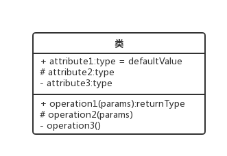
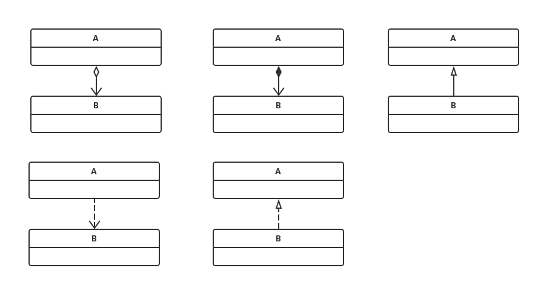

## 前言
发现自己的心最近有点浮躁了，每次都是有那么一段时间很堕落。不将这个了，今天要讲的是关于设计模式的基础UML，你们可以去知乎上搜一搜，对于UML褒贬不一。我个人感觉还是有用的，如果图能够说明很多语言无法简单描述的问题，那么是不是减少了很多不必要的沟通误会呢。而且理解UML对于自己动手理清思路也很有帮助。

## UML定义
统一建模语言（英语：Unified Modeling Language，缩写 UML）是非专利的第三代建模和规约语言。UML是一种开放的方法，用于说明、可视化、构建和编写一个正在开发的、面向对象的、软件密集系统的制品的开放方法。UML展现了一系列最佳工程实践，这些最佳实践在对大规模，复杂系统进行建模方面，特别是在软件架构层次已经被验证有效。

## 类图


```
1.类图前的+ - # 表示访问权限
+ 表示public
# 表示protect
- 表示private
2.类图有3层
第一层是类名
第二层是成员
第三层是方法
```

<!-- more -->

## UML关系符号


```
简单讲解下上图中5种类图关系。
聚集关系：聚集指的是集合中的冬季是可以独立出来，比如飞机和飞机场的关系。
组合关系：被包含者是包含者的一部分，比如汽车中的发动机
继承关系：B派生自A，A泛化了B
依赖关系：A依赖B，A使用B
实例关系
```

这其中在图中还会出现一些特殊的数字比如1..1 0..* 1..*
```
1..1: 表示另一个类的一个对象只与该类的一个对象有关
0..*：表示另一个类的一个对象与该类零个或多个对象有关
1..* 表示另一个类的一个对象只与该类零一个或多个一个对象有关
```

## 参考链接
[维基百科](https://zh.wikipedia.org/wiki/%E7%BB%9F%E4%B8%80%E5%BB%BA%E6%A8%A1%E8%AF%AD%E8%A8%80)
[博客](http://www.cnblogs.com/skywang12345/p/3523209.html)

<iframe frameborder="no" border="0" marginwidth="0" marginheight="0" width=330 height=86 src="//music.163.com/outchain/player?type=2&id=447280427&auto=1&height=66"></iframe>